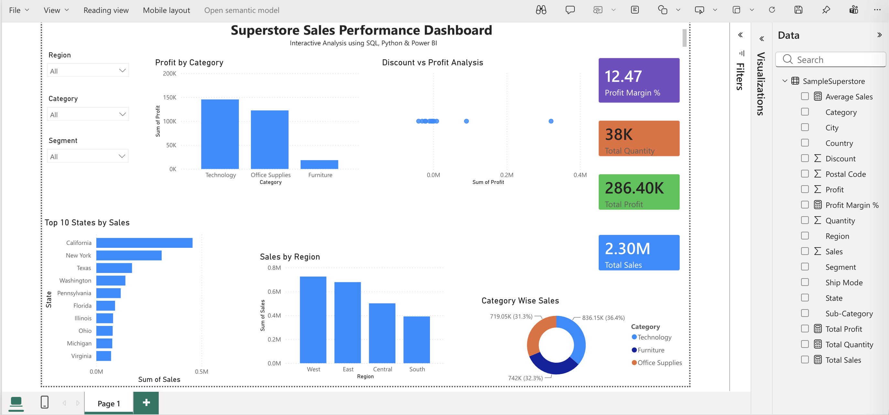

# 📊 Sales Data Analysis Dashboard

## Project Overview

This project analyzes Superstore sales data to identify business insights using SQL, Python, and Power BI.

The dashboard provides insights about:
- Sales performance
- Profit analysis
- Category-wise sales
- Regional performance
- Top performing states

## Tools & Technologies

- MySQL
- Python (Pandas, NumPy, Matplotlib)
- Power BI
- Excel
- Jupyter Notebook

## Dataset

Dataset: Sample Superstore Dataset

Contains:
- Orders
- Customers
- Products
- Sales
- Profit
- Discount

## SQL Analysis

Performed:
- Total Sales Analysis
- Profit Analysis
- Category Performance
- Regional Analysis
- Top States by Sales
- Advanced SQL Queries

## Python Analysis

Performed:
- Data Cleaning
- Exploratory Data Analysis
- Visualization
- Business Insights

## Power BI Dashboard

Dashboard includes:

- KPI Cards
- Sales by Region
- Profit by Category
- Top 10 States by Sales
- Category Wise Sales
- Discount vs Profit Analysis

## Dashboard Preview

## Key Insights

- Technology category generated highest profit.
- West region contributed highest sales.
- California was the top performing state.
- Profit margin was around 12%.

## Author

Pikesh Kumar